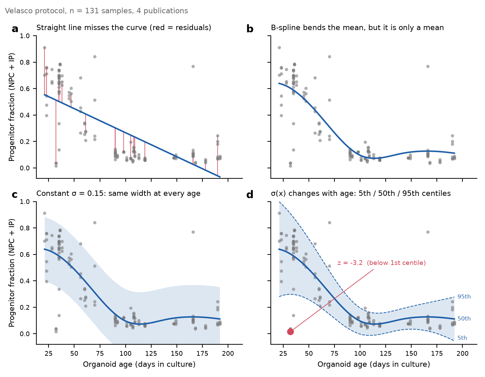
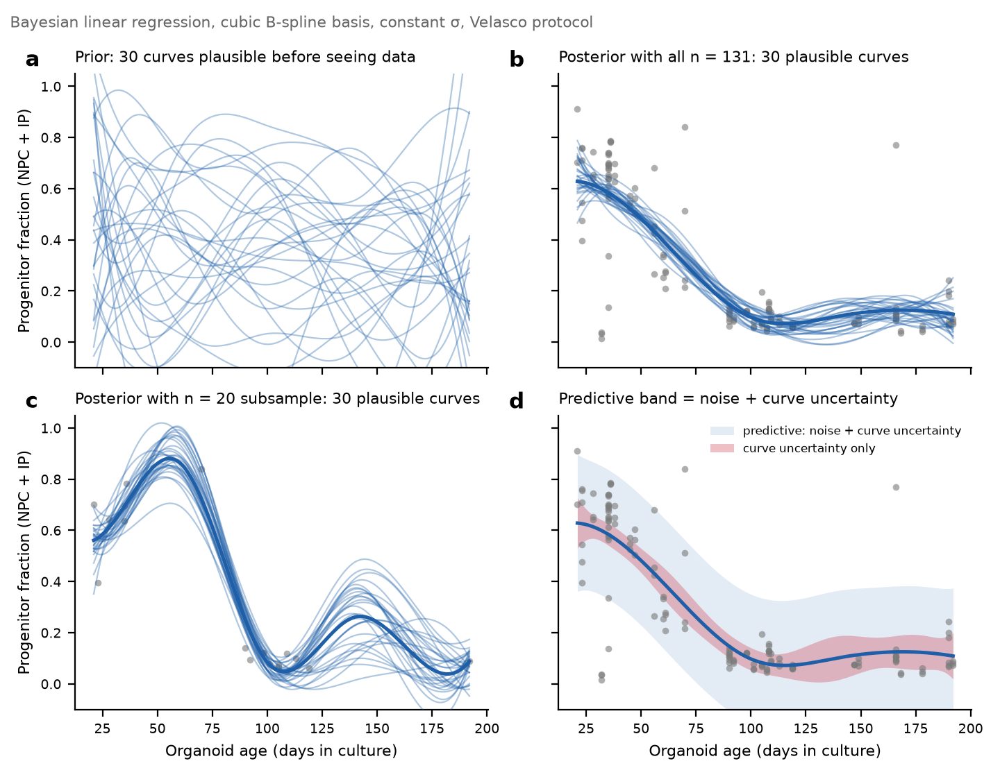
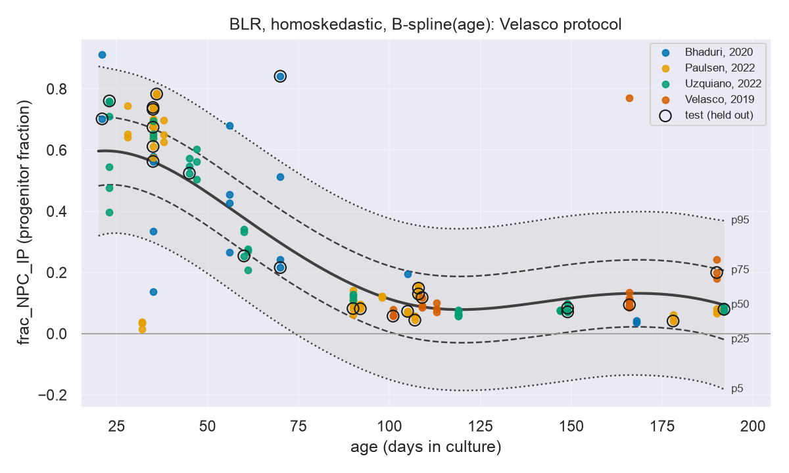
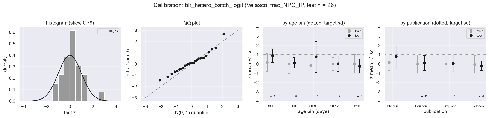
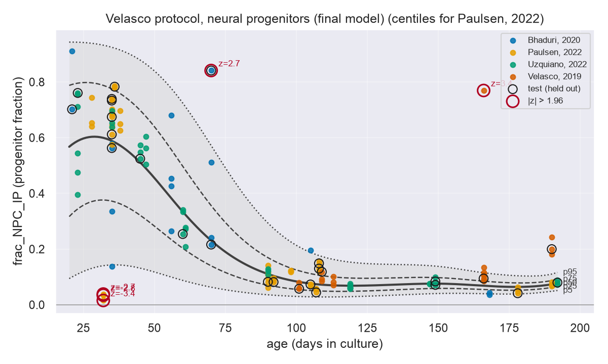
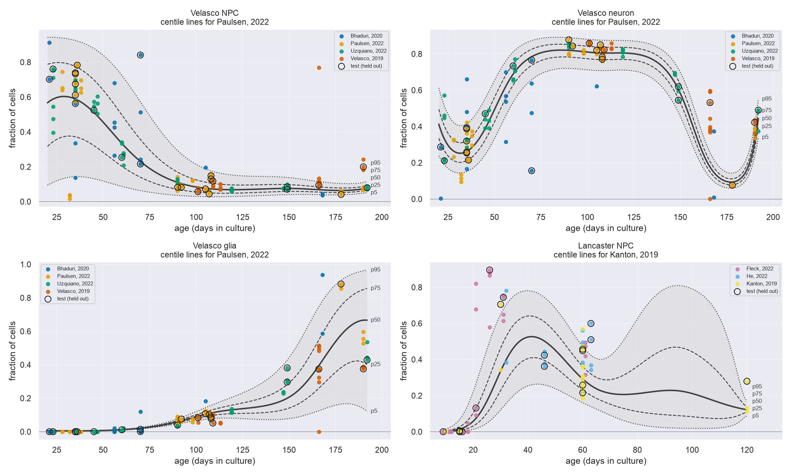
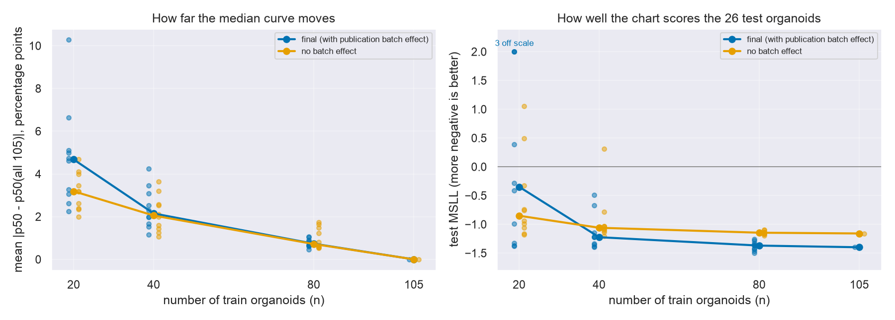

# 类器官生长曲线：这个 hackathon 项目从头到尾做了什么

Brainhack Montreal，2026 年 10 月 5 到 7 日。Boting Li（模型）、Selene（基线、数据图、扩展）。
Repo：https://github.com/Liberty23513/organoid-growth-charts

这份文档按项目实际发生的顺序写，每一步说三件事：做了什么，为什么做，结果是什么数。读完应该能自己向别人完整讲一遍，也能回答"为什么这么选"。

---

## 0. 一段话版本

儿童有生长曲线：把一个孩子的身高放到同龄人的百分位上。脑类器官（用干细胞培养出来的 1 到 3 毫米人脑组织球）没有这种东西，各实验室靠肉眼判断一批类器官"正不正常"。我们用公开的 HNOCA 图谱（177 万个细胞）算出 322 个类器官样本的细胞类型组成，对 Velasco protocol 的 131 个样本拟合了一个 normative model（常模模型）：x 是培养天数，y 是前体细胞比例，输出每个年龄上的 5/25/50/75/95 百分位线，以及每个类器官的 z 分数。比较了 6 个模型，选出一个在 26 个留出样本上校准良好的。131 个样本里 5 个被标为不典型。最后用子采样回答了"需要多少个类器官才能画这张图"：40 个起步，80 个稳定。

---

## 1. 问题（10 月 5 日之前）

**背景。** 脑类器官被用来研究脑发育和疾病，也越来越多地用于测药。它们公认的弱点是变异大：批次之间、细胞系之间、实验室之间都不一样。每个实验室都在问"这批正常吗"，但没有参照物。

**类比。** 儿科用生长曲线回答同样的问题。神经影像 2022 年做出了 brain charts（Bethlehem et al., Nature），方法叫 normative modelling：在参考人群里学习某个测量值随年龄的**分布**（不只是均值），再把每个新个体表示成对这个分布的偏离，也就是 z 分数。

**空白。** 类器官两者都没有。最接近的工作是 Faravelli et al. 2026（Arlotta 实验室），从转录组预测类器官的年龄，是一个"时钟"。我们问的是反方向：年龄已知，组成是否典型。

**承诺的交付物。** 周一提交的 GitHub issue 写了：保底是每个 protocol 一张 centile chart 加每个类器官一个 z 分数；stretch goal 是子采样曲线，回答需要多少个类器官。

---

## 2. 数据（10 月 2 日准备，10 月 5 日入 repo）

**来源。** Human Neural Organoid Cell Atlas（HNOCA，He, Dony, Fleck et al. 2024, Nature），CELLxGENE 上公开，CC BY 4.0，1,767,346 个细胞，18.8 GB 的 h5ad 文件。

**怎么变成 322 行的表。** `scripts/build_composition_table.py`。不下载整个文件：h5ad 内部是 HDF5，表达矩阵和细胞元数据分开存，脚本用 remfile + h5py 通过 HTTP range request 只读 8 列元数据（年龄、样本 id、文章、protocol、细胞系、细胞类型标签等），3 分钟，内存不到 1 GB。然后：

1. 定义"一个样本" = 数据集 id + bio_sample（bio_sample 名字跨数据集会重复，单独用只有 303 个，加上数据集 id 是 327 个）。
2. 检查每个样本只有一个年龄、一个细胞系（全部通过）。
3. 对 17 类 annot_level_2 细胞类型数比例，再合并成 4 组：frac_NPC_IP（前体：背侧 + 腹侧 + 非端脑 NPC + 背侧 IP）、frac_neuron、frac_glia、frac_neuroepithelium_PSC。
4. 丢掉少于 100 个细胞的样本。327 → 322。

**一个诚实的限制。** 一个"样本"是一次测序文库。HNOCA 的元数据分不出它是一个类器官还是几个合在一起测的。

**为什么只用 131 个。** 322 个样本分属 27 个 protocol。Velasco 2019 protocol 131 个（4 篇文章，21 到 192 天），Lancaster 2014 protocol 81 个（3 篇文章，9 到 120 天），其余 25 个 protocol 里 22 个只来自一篇文章，样本数个位数。不同 protocol 做出来的类器官轨迹本身就不同（Velasco 是 dorsal forebrain 定向分化，Lancaster 是 unguided），混在一起拟合一条曲线没有意义，就像男孩女孩要分开画生长曲线。所以一个 protocol 一张图，先做 Velasco。

**术语陷阱。** "Velasco 2019" 既是一个 protocol（131 个样本）也是一篇文章（21 个样本，只覆盖 101 到 190 天）。所有文档里都要说清指的是哪个。

**固定的 train/test 划分。** `data/split_velasco.csv`，按年龄段（0-30 / 30-60 / 60-90 / 90-120 / 120-200 天）分层抽 20% 做 test，seed 2026，105 train / 26 test。所有模型用同一份，所有指标在这 26 个样本上算。这是第一天定下的，后面没动过。

---

## 3. 概念基础（10 月 4 日晚，教程第 1、2 块）

写代码之前先搞清四件事。详细版在 `tutorial/growth_chart_tutorial_zh.md`，这里只记结论。

**回归给的是分布，不是线。** 直线回归（图 a）在这个数据上残差有规律，还在 190 天后预测负比例，形状错了。B-spline（图 b）把年龄轴切成几段，每段一个光滑的"鼓包"，数据决定每个鼓包多高，加起来就是曲线。它对参数仍然是线性的，所以叫 linear regression，也所以 Bayesian linear regression 能拟合非线性轨迹。但一条均值线回答不了"这个类器官正常吗"，还需要每个年龄上的散布 σ。

**百分位线 = μ(x) ± k·σ(x)。** 高斯假设下 p95 = μ + 1.645σ，p75 = μ + 0.674σ，p50 = μ。z = (y − μ) / σ。centile 和 z 是同一个位置的两种说法。常数 σ（图 c）会让带子到处一样宽；这个数据里早期散布是晚期的 3 倍（30 天 σ ≈ 0.19，100 天 ≈ 0.06），所以 σ 必须随年龄变（图 d）。

**贝叶斯加的是曲线本身的不确定性。** 先验是看数据前认为可能的曲线集合（图 a），后验是用数据过滤加权后剩下的（图 b）。后验的散开程度就是曲线的不确定性，点少的地方更宽。20 个样本时（图 c）曲线在没有数据的年龄段乱走，这就是 stretch goal 要量化的东西。预测分布 = 噪声 + 曲线不确定性（图 d），z 的分母用它。

**Centile 是估计值，不是测量值。** 它经过了模型，换模型会变，换数据也会变。好模型给出的 centile 应该和原始数据的经验分位数对得上。

---

## 4. 第一天（10 月 5 日下午）：跑通最简模型

**环境。** conda 环境 `normative`，Python 3.12，PCNtoolkit 1.3.0。1.0 之后 API 变化很大，第一步是 `inspect.signature` 打印实际安装版本的函数签名，不凭记忆写。核心对象四个：`NormData.from_dataframe`（包装 DataFrame，指定哪列是协变量、响应、batch）、`BsplineBasisFunction`、`BLR`、`NormativeModel`。

**模型 1，blr_homo。** `BLR(basis_function_mean=BsplineBasisFunction(degree=3, nknots=5), heteroskedastic=False)`。三次 B-spline，5 个节点，一个常数 σ。`fit_predict(nd_train, nd_test)` 几秒跑完。

**输出格式约定。** 每个模型写两个 CSV 到 `results/<model>/`：`centiles.csv`（age 20 到 192 每天一行，p5 到 p95）和 `zscores.csv`（每个样本的 y、μ、σ、z、split）。所有后续模型和组员的基线都用这个格式，所以能直接画在一张图上比。PCNtoolkit 不直接给 σ，从 centiles 反推 σ = (p95 − p50) / 1.645，手算的 z 和它的 z 一致到 1e-15。

**结果。** test 集 EXPV 0.786，SMSE 0.236，MSLL −0.731。看起来不错，但 z 的偏度 2.0、峰度 5.9，σ 到处 0.16，第 5 百分位线在 173 天里 118 天是负数。按年龄段看 z 的标准差：30 到 60 天 1.28，90 到 120 天 0.24。模型平均看是对的（|z| > 1.96 的有 6 个，期望 6.6），错在分配：早期该标的没标，晚期什么都标不出来。

**第一天结束时的状态。** 模型跑通，格式定了，知道了要修什么。组员第一天没有产出（环境问题），第二天补。

---

## 5. 第二天（10 月 6 日）：一次加一样东西，选出最终模型

### 5.1 五个指标各是什么

| 指标 | 看什么 | 好的方向 |
|---|---|---|
| EXPV（explained variance） | 均值线解释了 y 方差的多少 | 接近 1 |
| SMSE（standardized MSE） | 误差是"猜均值"的几分之几 | 接近 0，< 1 才有用 |
| MSLL（mean standardized log loss） | 整个预测分布给 test 样本打的分，σ 太宽太窄都扣分 | 越负越好 |
| Skewness | test z 的对称性 | 接近 0 |
| Kurtosis | test z 的尾巴厚度 | 接近 0 |

前两个只看 μ，所以 homo 和 hetero 几乎一样。后三个看分布，是选模型的依据。

### 5.2 六个模型

| 模型 | 加了什么 | MSLL | z 偏度 | p5 < 0 的天数 | 按年龄段 z 标准差 |
|---|---|---|---|---|---|
| baseline_rolling | 无模型，±15 天滑动窗口分位数（组员） | −0.98 | 0.97 | 0 | 0.62 / 0.98 / 1.21 / 1.01 / 0.88 |
| blr_homo | B-spline 均值，常数 σ | −0.73 | 2.01 | 118 | 0.89 / 1.28 / 1.04 / 0.24 / 0.82 |
| blr_hetero | σ 随年龄线性变化 | −0.81 | 2.02 | 119 | 0.74 / 1.11 / 1.04 / 0.27 / 1.16 |
| blr_hetero_batch | 加 publication batch effect（均值偏移 + 各自噪声水平） | −1.18 | 1.88 | 20 | 0.90 / 1.03 / 1.25 / 0.62 / 0.90 |
| blr_warped | SinArcsinh warp 处理偏斜 | −1.12 | 1.28 | 57 | 0.75 / 1.32 / 0.99 / 0.47 / 1.00 |
| **blr_hetero_batch_logit** | **hetero + batch，y 先 logit 变换** | **−1.40** | **0.78** | **0** | **0.93 / 0.97 / 0.98 / 0.73 / 0.94** |

每一行讲一句：

- **hetero 没怎么帮上忙**（−0.73 → −0.81）。原因是方差基函数是线性的，σ 只能一路升或一路降，画不出"先大、中间小、后面又大"的形状，90 到 120 天的 σ 还是太大。
- **batch effect 帮得最多**（→ −1.18）。不是因为实验室均值差很多（按文章看 z 均值都在 ±0.2 内），而是因为各实验室的**散布**不同：Uzquiano 的 z 标准差只有 0.5，Bhaduri 1.4。让每个实验室有自己的噪声水平，整体 σ 就不用被最散的实验室撑大。
- **warp 修了一半偏斜**（2.0 → 1.3），但 p5 还有 57 天为负。
- **logit 变换一次解决两个问题。** y 先变成 log(p / (1 − p))（p 夹到 [0.005, 0.995]），在 logit 空间拟合，centile 用 sigmoid 变回比例空间。比例永远在 0 和 1 之间，p5 不可能为负；接近 0 的那一侧被拉开，偏斜从 2.0 降到 0.78。MSLL −1.40，最好。
- **组员的无模型基线值得注意**：MSLL −0.98，比 blr_homo 和 blr_hetero 都好。这说明前两个模型的问题不是"没用模型"，而是模型假设错了。只有加了 batch 和 logit 之后，BLR 才真正超过了最朴素的分位数。

**选择规则**（事先定好，按顺序）：MSLL 最负；z 偏度最接近 0；分年龄段 z 标准差最接近 1；p5 不为负。四条都指向 blr_hetero_batch_logit。

### 5.3 校准检查

26 个 test 样本的 z：直方图和 QQ 图大体贴着标准正态，右尾略厚（那三个 32 天的样本）。按年龄段和按文章分组，z 的均值都在 0 附近，标准差都在 1 附近。这是"模型对所有年龄、所有实验室都诚实"的证据。

### 5.4 最终图

- 前体比例从 20 天的约 60% 降到 100 天的约 8%，然后持平。
- 带子早期宽、晚期窄。30 天：p5 到 p95 是 14% 到 94%。180 天：4% 到 10%。
- 5 个样本 |z| > 1.96（随机期望 6.5 个，所以没有过度报警）：32 天的三个 Paulsen 2022 样本几乎没有前体（z = −3.4、−2.8、−2.7），70 天的一个 Bhaduri 样本和 166 天的一个 Velasco 2019 样本前体太多（z = +2.7、+3.4）。chart 只能说它们不典型，原因要回原文查。
- 曲线画的是 Paulsen 2022（样本最多的文章）的偏移，其他实验室有各自的偏移。

### 5.5 封装和扩展

最终模型封装成 `src/growth_chart.py` 的 `fit_growth_chart(df, y_col, ...)` 和 `plot_growth_chart(...)`。组员用它跑了：

- **Velasco neuron**：前体的镜像，MSLL −1.15，偏度 −0.47，没有样本被标。
- **Velasco glia**：90 天前接近 0，之后上升。MSLL −3.25。
- **Lancaster NPC**：81 个样本但 63 到 120 天之间没有数据，test z 标准差 1.6，带子在空白处鼓起来。这是方法的演示和数据的警告，不是结果。

### 5.6 子采样：需要多少个类器官

从 105 个 train 样本里按年龄段分层随机抽 n = 20、40、80 个，每个 n 抽 10 次，每次重新拟合最终模型，和 105 个全拟合的曲线比。

| n | p50 曲线平均偏离（百分点） | test MSLL | test z 标准差 |
|---|---|---|---|
| 20 | 4.8 | +2.07（比猜均值还差） | 2.49 |
| 40 | 2.4 | −1.14 | 1.22 |
| 80 | 0.8 | −1.38 | 0.95 |
| 105 | 0 | −1.40 | 0.87 |

结论：**20 个不能用，40 个能画出第一张图，80 个稳定。** 另外，n = 20 时不带 batch effect 的模型（橙色）比带的好，因为每个实验室只剩两三个样本，估不出实验室偏移。经验规则：每个实验室少于约 10 个样本时去掉 batch effect。

注意：子集是从同一批 105 个样本里抽的，80 个时的稳定性偏乐观。

---

## 6. 这个项目是什么、不是什么、下一步

**有了什么。** 从公开图谱到校准过的 centile chart 和每个类器官的 z 分数，一条完整的流水线，一个公开 repo，几分钟可复现。方法上确认了四件事：σ 必须随年龄变，实验室差异主要在散布不在均值，比例数据必须处理 0 边界，131 个样本够画图但 20 个不够。

**限制。**
1. 131 个样本，不是 brain charts 的几万个。带子包含了曲线本身的后验不确定性，所以它诚实地宽。
2. "样本"是测序文库，不一定是一个类器官。
3. 文章和年龄混淆：Velasco 2019 文章没有 101 天前的样本，它的实验室偏移在早期是外推的。
4. 四个比例加起来是 1，我们对每个比例单独建模。正确的做法是 compositional 模型（Dirichlet 或 logistic-normal 似然）。
5. B-spline 节点数（5）用的默认值，没有调过。

**下一步。**
- HNOCA 每次更新都是一次免费的重新拟合。
- 换 compositional 似然。
- 真正的用途：拿一组疾病或药物处理的类器官，问哪种细胞类型最先离开正常带。

---

## 7. Repo 导航

| 路径 | 内容 |
|---|---|
| `data/hnoca_sample_composition.csv` | 322 行工作数据 |
| `data/split_velasco.csv`, `split_lancaster.csv` | 固定 train/test 划分 |
| `scripts/build_composition_table.py` | 从 HNOCA 重建 CSV |
| `src/growth_chart.py` | 最终模型的 fit / plot / metrics 函数 |
| `notebooks/02_baseline_centiles.ipynb` | 组员的滑动窗口基线 |
| `notebooks/03_pcntoolkit_blr.ipynb` | 6 个模型的比较和校准（主 notebook） |
| `notebooks/05_subsampling.ipynb` | 子采样 |
| `notebooks/06_extensions.ipynb` | neuron / glia / Lancaster |
| `results/<model>/centiles.csv`, `zscores.csv` | 每个模型的输出，统一格式 |
| `results/blr_metrics.csv` | 6 模型对比表 |
| `results/subsampling/runs.csv`, `curves.csv` | 子采样原始结果 |
| `figures/` | 所有图 |
| `tutorial/` | 概念教程（中英文）和本文档 |
| `pitch/` | 周一的 pitch deck、周三的总结 deck 和讲稿 |

---

## 8. 参考文献

1. He, Dony, Fleck et al. 2024, Nature. An integrated transcriptomic cell atlas of human neural organoids (HNOCA). 数据来源。
2. Bethlehem et al. 2022, Nature. Brain charts for the human lifespan.
3. Rutherford et al. 2022, Nature Protocols. The normative modeling framework for computational psychiatry. PCNtoolkit 流程。
4. Marquand et al. 2016, Biological Psychiatry. Normative modelling 原始论文。
5. Fraza et al. 2021, NeuroImage. Warped BLR.
6. Bayer et al. 2022, NeuroImage. HBR 处理 site effect。
7. Faravelli, Antón-Bolaños, Wei et al. 2026, Nature. Human brain organoids record the passage of time over multiple years. 最接近的先前工作。
8. Velasco et al. 2019, Nature. 本项目主要 protocol 的来源。
